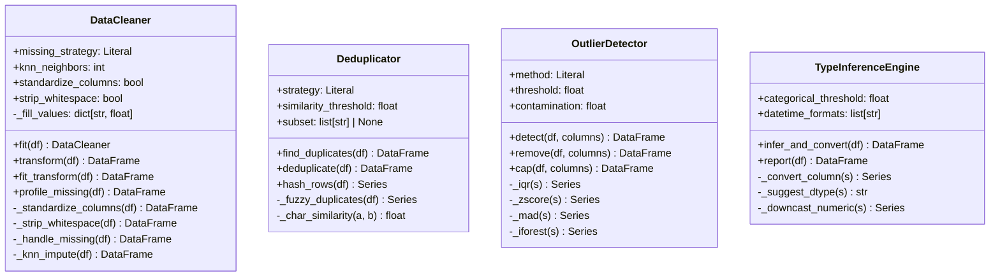

# Módulo `dataspark.cleansing` — documentación completa (fase 1)

Este documento cubre **todas las funciones y métodos** del módulo de limpieza de datos, incluyendo objetivos, parámetros, retornos y flujo de ejecución. También incluye un diagrama de clases para visualizar responsabilidades y relaciones.

## 1) Diagrama de clases

## 2) `DataCleaner` (`cleaner.py`)

### Responsabilidad
Pipeline de limpieza general orientado a:
- estandarizar nombres de columnas,
- limpiar espacios en textos,
- imputar/eliminar nulos.

### Métodos

#### `__init__(missing_strategy, knn_neighbors, standardize_columns, strip_whitespace)`
Configura la estrategia de limpieza y el estado interno (`_fill_values`).

#### `fit(df)`
Aprende estadísticos para imputación (`mean`, `median`, `mode`) y los guarda en `_fill_values`.

#### `transform(df)`
Ejecuta pipeline completo sobre copia del DataFrame en este orden:
1. `_standardize_columns` (opcional),
2. `_strip_whitespace` (opcional),
3. `_handle_missing`.

#### `fit_transform(df)`
Atajo de conveniencia para `fit(df).transform(df)`.

#### `profile_missing(df)`
Genera un reporte con:
- `missing_count`,
- `missing_pct`,
ordenado de mayor a menor y filtrado a columnas con nulos.

#### `_standardize_columns(df)`
Convierte nombres de columnas a un formato tipo `snake_case`:
- trim,
- lowercase,
- reemplazo de no-palabras por `_`,
- recorte de `_` en extremos.

#### `_strip_whitespace(df)`
Aplica `str.strip()` a columnas de tipo objeto/string.

#### `_handle_missing(df)`
Despacha la estrategia según `missing_strategy`:
- `drop`: elimina filas con nulos,
- `ffill`: relleno hacia adelante y atrás,
- `knn`: delega en `_knn_impute`,
- `mean/median/mode`: usa `_fill_values` en numéricas y moda para categóricas.

#### `_knn_impute(df)`
Imputa columnas numéricas con `KNNImputer` y reanexa columnas no numéricas.

---

## 3) `Deduplicator` (`deduplication.py`)

### Responsabilidad
Detección y eliminación de duplicados exactos o aproximados.

### Métodos

#### `__init__(strategy, similarity_threshold, subset)`
Configura modo de deduplicación y columnas clave opcionales.

#### `find_duplicates(df)`
Retorna solo las filas marcadas como duplicadas.

#### `deduplicate(df)`
Retorna DataFrame sin duplicados:
- exacto: `drop_duplicates`,
- fuzzy: usa máscara de `_fuzzy_duplicates`.

#### `hash_rows(df)`
Genera hash SHA-256 por fila (útil para huellas determinísticas).

#### `_fuzzy_duplicates(df)`
Construye máscara booleana por comparación greedy contra filas ya vistas. Complejidad aproximada O(n²).

#### `_char_similarity(a, b)`
Calcula similitud Jaccard de bigramas de caracteres.

---

## 4) `OutlierDetector` (`outliers.py`)

### Responsabilidad
Detectar y tratar outliers en variables numéricas.

### Métodos

#### `__init__(method, threshold, contamination, factor)`
Configura método de detección. `factor` actúa como alias de compatibilidad para `threshold`.

#### `detect(df, columns)`
Devuelve DataFrame booleano (`True = outlier`) por columna evaluada.

#### `remove(df, columns)`
Elimina filas con al menos un outlier en las columnas analizadas.

#### `cap(df, columns)`
Winsorización por límites IQR (`clip`) en vez de eliminar filas.

#### `_iqr(s)`
Regla IQR clásica (`Q1 - k*IQR`, `Q3 + k*IQR`).

#### `_zscore(s)`
Outlier por valor absoluto de z-score.

#### `_mad(s)`
Outlier por modified z-score con MAD.

#### `_iforest(s)`
Outlier por `IsolationForest` univariado (serie por serie).

---

## 5) `TypeInferenceEngine` (`type_inference.py`)

### Responsabilidad
Inferir y convertir tipos de datos para mejorar semántica y memoria.

### Métodos

#### `__init__(categorical_threshold, datetime_formats)`
Configura umbral para categoría y formatos candidatos de fecha.

#### `infer_and_convert(df)`
Convierte columnas usando `_convert_column` y registra reducción de memoria.

#### `report(df)`
Construye reporte de:
- tipo actual,
- tipo sugerido,
- cardinalidad (`nunique`),
- porcentaje nulo.

#### `_convert_column(s)`
Heurística de conversión por orden:
1. booleano,
2. datetime,
3. numérico desde string,
4. downcast numérico,
5. categoría.

#### `_suggest_dtype(s)`
Devuelve el nombre de dtype sugerido (resultado de `_convert_column`).

#### `_downcast_numeric(s)`
Reduce precisión/tamaño de floats e ints cuando es posible.

---

## 6) Notas de diseño

- Todas las clases mantienen interfaz simple y orientada a pandas.
- Los métodos internos (`_...`) encapsulan reglas y evitan duplicación.
- El módulo está preparado para uso en pipelines de ML/EDA al estilo `fit/transform`.
