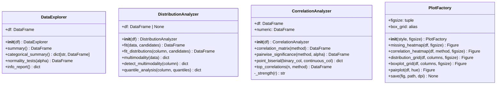

# Módulo `dataspark.eda` — documentación completa (fase 3)

Este documento cubre **todas las funciones del módulo EDA** y resume su arquitectura con un diagrama de clases.

## 1) Diagrama de clases

## 2) `DataExplorer` (`explorer.py`)

### Responsabilidad
Perfilado estadístico general del dataset:
- descriptivos extendidos,
- resumen categórico,
- pruebas de normalidad,
- metadatos de calidad del dataset.

### Métodos
- `summary()`: estadísticas numéricas extendidas (`skewness`, `kurtosis`, `missing`, `iqr`, `cv`).
- `categorical_summary()`: tablas de frecuencia/porcentaje por variable categórica.
- `normality_tests(alpha)`: Shapiro-Wilk o D’Agostino-Pearson según tamaño muestral.
- `info_report()`: forma, memoria, tipos, nulos, duplicados y listas de columnas.

---

## 3) `DistributionAnalyzer` (`distributions.py`)

### Responsabilidad
Modelado de distribuciones y diagnóstico de forma.

### Métodos
- `fit(data, candidates)`: ajusta distribuciones candidatas y ordena por BIC.
- `fit_distributions(column, candidates)`: wrapper legado para columna de `self.df`.
- `multimodality(data)`: calcula coeficiente de bimodalidad y bandera multimodal.
- `detect_multimodality(column)`: wrapper legado por columna.
- `quantile_analysis(column, quantiles)`: percentiles, IQR y rango.

---

## 4) `CorrelationAnalyzer` (`correlations.py`)

### Responsabilidad
Análisis de asociaciones lineales/rankeadas con significancia.

### Métodos
- `correlation_matrix(method)`: matriz de correlación (`pearson/spearman/kendall`).
- `pairwise_significance(method, alpha)`: pares de variables con `p_value` y etiqueta de fuerza.
- `point_biserial(binary_col, continuous_col)`: correlación para binaria vs continua.
- `top_correlations(n, method)`: ranking de correlaciones absolutas más fuertes.
- `_strength(r)`: mapeo cualitativo (`negligible` → `very_strong`).

---

## 5) `PlotFactory` (`visualizations.py`)

### Responsabilidad
Generar visualizaciones EDA reutilizables con retorno explícito de `Figure`.

### Métodos
- `missing_heatmap(df, figsize)`: mapa de nulos.
- `correlation_heatmap(df, method, figsize)`: heatmap triangular de correlaciones.
- `distribution_grid(df, columns, figsize)`: histogramas + KDE por variable.
- `boxplot_grid(df, columns, figsize)`: boxplots para inspección de outliers.
- `pairplot(df, hue)`: dispersión multivariable tipo Seaborn.
- `save(fig, path, dpi)`: persistencia en disco y cierre de figura.
- `box_grid`: alias de compatibilidad para `boxplot_grid`.

---

## 6) Notas de diseño

- El módulo separa responsabilidades estadísticas (`DataExplorer`, `DistributionAnalyzer`, `CorrelationAnalyzer`) de visualización (`PlotFactory`).
- Todas las utilidades son compatibles con pipelines exploratorios y notebooks.
- Las APIs legadas por nombre de columna se mantienen para compatibilidad hacia atrás.
