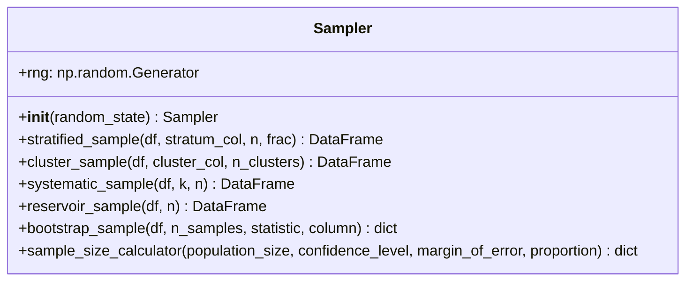

# Módulo `dataspark.sampling` — documentación completa (fase 2)

Este documento describe **todas las funciones** del módulo de muestreo (`Sampler`) y presenta un diagrama de clases para clarificar responsabilidades.

## 1) Diagrama de clases

## 2) Clase `Sampler` (`sampler.py`)

### Responsabilidad
Proveer estrategias de muestreo usadas en estadística aplicada y ML:
- estratificado,
- por conglomerados,
- sistemático,
- reservoir sampling,
- bootstrap,
- cálculo de tamaño de muestra (Cochran + corrección por población finita).

### Métodos

#### `__init__(random_state=42)`
Inicializa un generador pseudoaleatorio (`np.random.default_rng`) para reproducibilidad.

#### `stratified_sample(df, stratum_col, n=None, frac=None)`
Muestreo estratificado proporcional:
- Si `n` está definido, reparte cupos aproximados por proporción de estrato.
- Si `frac` está definido, toma la misma fracción por estrato.

Lanza `ValueError` si no se define ni `n` ni `frac`.

#### `cluster_sample(df, cluster_col, n_clusters)`
Selecciona `n_clusters` conglomerados al azar y devuelve **todas** sus observaciones.

#### `systematic_sample(df, k=None, n=None)`
Muestreo sistemático:
- toma cada `k`-ésimo elemento desde un inicio aleatorio,
- o calcula `k` automáticamente desde `n` objetivo.

Lanza `ValueError` si faltan ambos parámetros.

#### `reservoir_sample(df, n)`
Implementa Algorithm R (Vitter) para muestreo uniforme en escenarios tipo stream.

#### `bootstrap_sample(df, n_samples=1000, statistic="mean", column=None)`
Genera réplicas bootstrap con reemplazo y reporta:
- valor medio del estadístico en réplicas,
- desviación estándar bootstrap,
- intervalo percentil 95% (`2.5`, `97.5`).

#### `sample_size_calculator(population_size, confidence_level=0.95, margin_of_error=0.05, proportion=0.5)`
Calcula tamaño de muestra requerido usando:
- fórmula de Cochran (`n0`),
- corrección por población finita (FPC).

Devuelve diccionario con `required_sample_size` y parámetros usados.

---

## 3) Notas de diseño

- `Sampler` concentra una API compacta y pragmática para notebooks y pipelines.
- Todas las operaciones retornan nuevos objetos (DataFrame/dict) sin mutar el DataFrame de entrada.
- El RNG encapsulado evita depender del estado global aleatorio.
