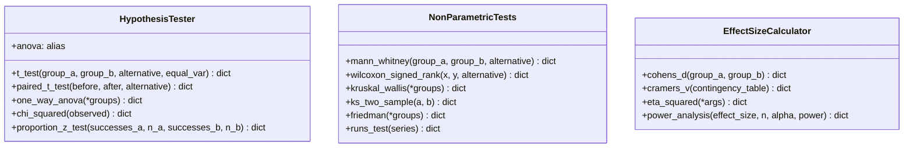

# Módulo `dataspark.statistical` — documentación completa (fase 4)

Este documento resume todas las funciones del módulo estadístico y su arquitectura.

## 1) Diagrama de clases

## 2) `HypothesisTester` (`hypothesis.py`)

### Responsabilidad
Pruebas paramétricas con salida estructurada:
- t-test independiente (Student/Welch),
- t-test pareado,
- ANOVA de una vía,
- chi-cuadrado de independencia,
- z-test para diferencia de proporciones.

### Métodos
- `t_test(...)`: compara dos grupos independientes con alternativa configurable.
- `paired_t_test(...)`: compara medidas repetidas pareadas.
- `one_way_anova(*groups)`: contrasta igualdad de medias en >=2 grupos.
- `anova`: alias de compatibilidad.
- `chi_squared(observed)`: independencia en tabla de contingencia.
- `proportion_z_test(...)`: contraste de dos proporciones.

---

## 3) `NonParametricTests` (`nonparametric.py`)

### Responsabilidad
Pruebas no paramétricas para escenarios con supuestos débiles.

### Métodos
- `mann_whitney(...)`: alternativa no paramétrica para dos grupos independientes.
- `wilcoxon_signed_rank(...)`: alternativa pareada no paramétrica.
- `kruskal_wallis(*groups)`: ANOVA no paramétrica.
- `ks_two_sample(a, b)`: compara distribuciones empíricas.
- `friedman(*groups)`: medidas repetidas no paramétricas.
- `runs_test(series)`: aleatoriedad de secuencias en torno a mediana.

---

## 4) `EffectSizeCalculator` (`effect_size.py`)

### Responsabilidad
Medir magnitud práctica del efecto y aproximar potencia.

### Métodos
- `cohens_d(group_a, group_b)`: tamaño de efecto para dos grupos independientes.
- `cramers_v(contingency_table)`: asociación para tablas de contingencia.
- `eta_squared(*args)`: tamaño de efecto ANOVA (desde F+DF o desde grupos crudos).
- `power_analysis(...)`: potencia alcanzada dado `n` o tamaño requerido dado `power`.

---

## 5) Notas de diseño

- Las clases devuelven `dict` homogéneos para facilitar serialización/reporting.
- Se mantiene compatibilidad con nombres alias (`anova`).
- Los métodos están orientados a análisis exploratorio y validación estadística en pipelines de ciencia de datos.
